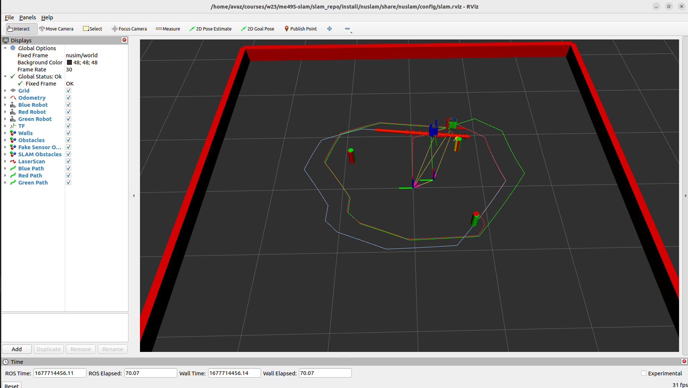

# ME495 Sensing, Navigation and Machine Learning For Robotics
* Ava Zahedi
* Winter 2023
# Package List
This repository consists of several ROS packages
- nuturtle_description - This package contains urdf files and basic debugging, testing, and visualization code for the WI2023 ME 495 robots.
- nusim - This package provides a simulated robot environment and uses rviz2 for visualization for a red NU turtlebot.
- nuturtle_control - This package enables control of the turtlebot via messages on the cmd_vel topic.
- nuslam - This package allows the turtlebot to perform SLAM with an Extended Kalman Filter implementation.

This repository also contains a custom C++ library
-  turtlelib - A library for handling transformations in SE(2) and other turtlebot-related math.
    * rigid2d -  vectors, twists, and transformations in 2D
    * diff_drive - kinematics for a differential drive robot in 2D
    * kalman - Extended Kalman Filter implementation

# Launch File Details
* `ros2 launch nuslam slam.launch.xml`  
    Command line arguments:
    - cmd_src - source of cmd_vel messages
      - Options are [teleop, circle, none], defaults to "none" 
    - robot - choice of robot
      - Options are [nusim, localhost, none], defaults to "nusim"
    - use_rviz - whether or not rviz launches
      - Options are [true, false], defaults to "true"

# Physical Testing

https://user-images.githubusercontent.com/39091881/217675003-65603068-d647-48b0-9b35-b3caaebb7e03.webm

https://user-images.githubusercontent.com/39091881/217676673-e88fd6c2-ac00-4a10-90e9-774d241c1904.mp4

Final location of the turtlebot according to odometry:  
```
header: 
  stamp:  
    sec: 1675895543  
    nanosec: 972643133  
  frame_id: odom  
child_frame_id: blue/base_footprint  
pose:  
  pose:  
    position:  
      x: 0.1413477247789586  
      y: -0.07751904756869547  
      z: 0.0  
    orientation:  
      x: 0.0  
      y: 0.0  
      z: -0.04191423777375463  
      w: 0.9991212122019255  
```

# SLAM in Simulation
Final result:  



Demo video:  

https://user-images.githubusercontent.com/39091881/222293875-aa12083c-0d6c-4983-bd7b-4209988d4196.webm
