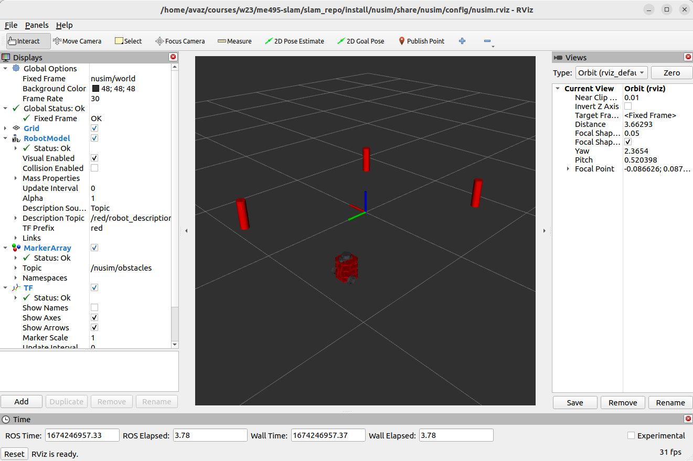

# nusim  Description
A simulator and visualizer for a red NU turtlebot. This node provides a simulated robot environment and uses rviz2 for visualization.
* `ros2 launch nusim nusim.launch.xml` to see the robot and specified obstacles in rviz.

# Launch File Details
* `ros2 launch nusim nusim.launch.xml`
    Parameters, which can be changed in config/basic_world.yaml:
    - rate: frequency of timer callback (defaults to 200 Hz)
    - x0: initial x-coordinate of the robot (m)
    - y0: initial y-coordinate of the robot (m)
    - theta0: initial rotation of the robot (rad)
    - obstacles
        - x: list of x-coordinates of obstacles (m)
        - y: list of y-coordinates of obstacles (m)
        - r: radius of obstacles (m)

Worked With: Meg Sindelar, Katie Hughes, Rintaroh Shima, Ritika Ghosh, Allan Garcia, Shantao Cao, Nick Morales, Liz Metzger