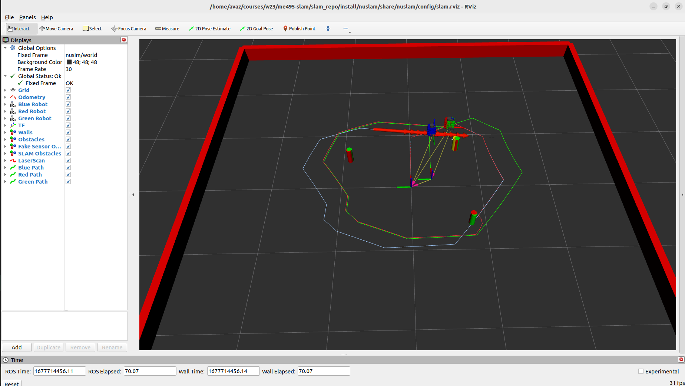

# nuslam Description
This node implements an Extended Kalman Filter for SLAM on a NU turtlebot. The launch file launches the node as well as a simulator and visualizer.

# nuslam Node Details
nuslam node parameters:
    - body_id (string): body frame ID
    - odom_id (string): odom frame ID
    - wheel_left (string): left wheel frame ID
    - wheel_right (string): right wheel frame ID
    - wheel_radius (double): wheel radius
    - track_width (double): track width (distance between the wheels)

# Launch File Details
* `ros2 launch nuslam slam.launch.xml`
    
    Launch file arguments:
    - cmd_src: source of cmd_vel commands
        - defaults to none
    - robot: robot to run on
        - defaults to nusim
    - use_rviz: whether or not to run rviz
        - defaults to true

Worked With: Meg Sindelar, Katie Hughes, Rintaroh Shima, Ritika Ghosh, Allan Garcia, Shantao Cao, Nick Morales, Liz Metzger, Marno Nel