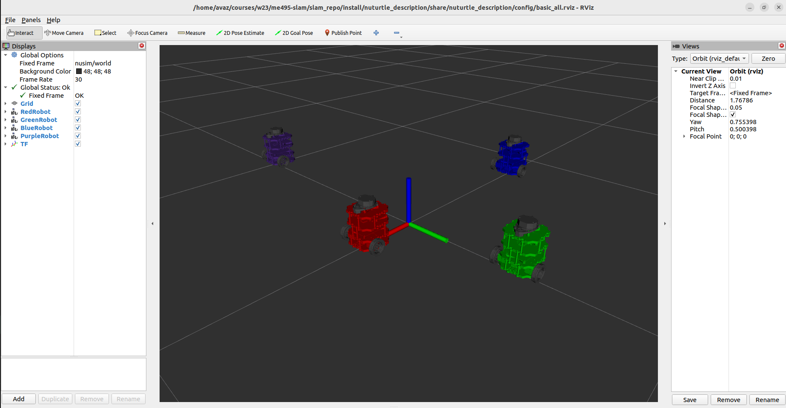

# Nuturtle  Description
URDF files for Nuturtle TurBo
* `ros2 launch nuturtle_description load_one.launch.py` to see the robot in rviz.
* `ros2 launch nuturtle_description load_all.launch.xml` to see four copies of the robot in rviz.

* The rqt_graph when all four robots are visualized (Nodes Only, Hide Debug) is:

# Launch File Details
* `ros2 launch nuturtle_description load_one.launch.py --show-args`
        Arguments (pass arguments as '<name>:=<value>'):

            'color':
                Robot base_link color. Valid choices are: ['red', 'green', 'blue', 'purple']
                (default: 'purple')

            'rvizconfig':
                Path to rviz config file
                (default: LocalVar('FindPackageShare(pkg='nuturtle_description') + 'config' + LaunchConfig('rviz_color')'))

            'use_rviz':
                Launch rviz if use_rviz is true. Valid choices are: ['true', 'false']
                (default: 'true')

            'use_jsp':
                Launch joint_state_publisher_gui if view_only is true. Valid choices are: ['true', 'false']
                (default: 'true')

* `ros2 launch nuturtle_description load_all.launch.xml --show-args`
        Arguments (pass arguments as '<name>:=<value>'):

            'color':
                Robot base_link color. Valid choices are: ['red', 'green', 'blue', 'purple']
                (default: 'purple')

            'rvizconfig':
                Path to rviz config file
                (default: LocalVar('FindPackageShare(pkg='nuturtle_description') + 'config' + LaunchConfig('rviz_color')'))

            'use_rviz':
                Launch rviz if use_rviz is true. Valid choices are: ['true', 'false']
                (default: 'true')

            'use_jsp':
                Launch joint_state_publisher_gui if view_only is true. Valid choices are: ['true', 'false']
                (default: 'true')

Worked With: Dilan Wijesinghe, Meg Sindelar, Katie Hughes, Rintaroh Shima, James Oubre, Ritika Ghosh, Sushma Chandra, Allan Garcia